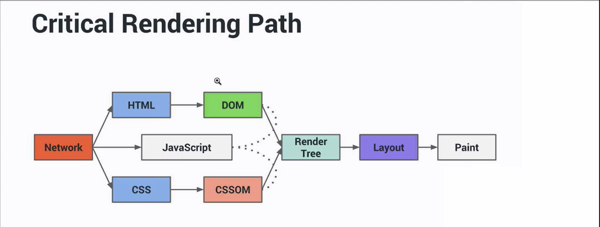

# Performance web

## Minify


- Use minify in files (HTML, CSS JS) that go to Production

[Minify Online](https://refresh-sf.com/)
[Minify CMD](https://github.com/mishoo/UglifyJS)

**Note: This process can be automated with Gulpe and the node module mentioned above.**


## Server Settings

- Configure Gzip on the HTTP server.
- Configure Cache for assets folder (NO CACHE THE INDEX.html FILE)
	- cache-control: public (for images, css, js, static pages)


## Images

- Resize the images to the size that will be used (Ex: From 1000x1000 to 50x50)

- [Online Lossless Optimization - Kraken](https://kraken.io/)
- [Online Lossless Optimization - Tiny](https://tinypng.com/)
- [Offline lossless optimization - ImageOptim](https://imageoptim.com/mac)
- [Offline lossless optimization - RIOT](https://riot-optimizer.com/)
- [Lossless CMD optimization - JpegTran](https://jpegclub.org/jpegtran/)

- Other Tools:
	- PngCrush
	- svgomg
	- svgo (Can be used with NodeJS)
	- ImageMin (Can be used with NodeJS)
-  [ImageMagick](https://imagemagick.org/) (to resize images with mogrify run: ``magick mogrify -resize 50x50 site/assets/img/aluno-*``)

### Sprites

To create sprites [ImageMagick](https://imagemagick.org/) can be used the to do this.

sample: ``magick convert site/assets/img/*.png -append site/assets/img/diferenciais.png``

If automation is required, [ImageMagick](https://github.com/twolfson/gulp.spritesmith) can be used


#### SVG-Sprites

to automate the creation of svg-sprites you can use the module https://github.com/jkphl/svg-sprite (follow the settings to be able to use)


svg-sprites example:

```	
	<svg width="0" height="0" version="1.1" xmlns="http://www.w3.org/2000/svg">
		<defs>
			<symbol id="mobile" viewBox="0 0 22 33">
				<path d="M17.612 29.584H3.604c-.384 0-.662-.304-.662-.76v-5.51h15.332v5.51c0 .456-.278.76-.662.76zM3.604 2.942h14.008c.384 0 .662.29.662.654v17.396H2.942V3.596c0-.364.278-.654.662-.654zm17.613.697A3.64 3.64 0 0 0 17.577 0H3.64A3.64 3.64 0 0 0 0 3.64v25.24a3.64 3.64 0 0 0 3.64 3.64h13.937a3.64 3.64 0 0 0 3.64-3.64V3.64zM10.837 25h-.175C9.744 25 9 25.783 9 26.75s.744 1.75 1.662 1.75h.175c.92 0 1.663-.783 1.663-1.75S11.756 25 10.837 25"/>
			</symbol>
		</defs>
	</svg>
```


example of how to use in HTML:
```
	<svg class="categoriaCard-item-icone"><use xlink:href="assets/img/categorias.svg#mobile"/></svg>
```

### Image Request Parallelism

as we only have 6 connections per host to make requests.

Make a new hostname (different server) to be able to help with the limitation and thus download images faster for example

## Requests

Concatenating the CSS helps when the front end executes the requests, instead of making 25 requests it executes only 1 request.

this process can be automated with Gulp-useref.

to test the performance of your application use the following sites: 
- https://developers.google.com/speed/pagespeed/insights/?hl=en

- https://www.webpagetest.org/
	- as main goals to be analyzed are: "Visual Progress", "Start Render" and "Speed Index"

## Inline resources

Used JS files that are imported on the page, and SVG images that are also used can be placed inside the HTML file, to do this in an automated way just create the INLINE attribute in your tag and run the gulp inlineSource (gulp-inline-source)
 

example: `` <script inline src = "assets / js / home.js"> </script> or  ``


try to leave the size of the HTML index with a maximum of 14KB gzipped, including the headers of the HTTP response
  

## Critical Path (Render Optimization)

- put the CSS at the beginning of the HEAD tag
- JS files must be placed at the end of the Body tag (before closing the tag)




## Asynchronous

- use Asynchronous tag
- use setTimeout
- use requestAnimationFrame (for animation)
- use requestIdleCallback (runs only when the browser is idle)

### Async attribute
if JS does not depend on others, ASYNC can be used to make this request without disturbing the others. So, you can put back the scripts that are necessary for the initial part of the page in HEADER (ex: menuJS) and continue at the end of BODY with the others (ex: footerJS)

Example of the ASYNC script tag: ```<script async src =" assets / js / menu.js "> </script>```
Gulp-useref also has the ASYNC option

### setTimeout 
You can use setTimeout to postpone the execution of some JS that are not so important for the website at the beginning of the execution, so there will be fewer tasks for the processor to execute and it may cause the website to crash less.

Example: ```setTimeout(function(){ /*...YOU_FCODE...*/ }, 1000);```

Essa estrategia também pode ser usada para carregamento de videos. (Ex: colocar o iFrame no HTML depois de 1.5s)

## Lazy Load

Lazy Load helps make requests for images only when the user scrolls down.
other example with window resize https://gist.github.com/sergiolopes/e326e62a44c8095021d443401dcf5320
Example: 
```
	window.onscroll = function(){

		var imgs = document.querySelectorAll('img[data-src]:not([src])');

		for (var i = 0; i < imgs.length; i++) { // Error with forEach

			if(imgs[i].getBoundingClientRect().top < window.innerHeight + 200){
				imgs[i].src = imgs[i].getAttribute('data-src');
			}
		}
	}
```

Reminder: Take into account the slow technology

### CSS Assync
 
 ````
	<style> YOUR_CSS </style>

	<link rel="preload" as="style" href="YOUR.CSS" onload="this.rel='stylesheet'">
	<noscript><link rel="sylesheet" href="YOUR.CSS"></noscript>

	<script> src="loadcss.js"</script>
	<script> src="cssrelpreload.js"</script>

 ```